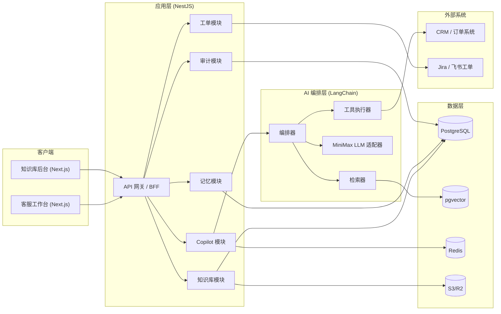

# 客服 Copilot 架构设计（MVP）

## 1）产品目标
构建一个企业内部客服 Copilot，帮助客服人员基于知识库生成可靠回复，并在不确定时自动引导澄清或升级工单。

## 2）MVP 范围（2 周）
- 人工审核后发送（不做自动直发客户）。
- 支持知识库导入（Markdown/PDF 导出文本）。
- 基于检索增强生成（RAG 思路）返回答案与引用。
- 支持短期记忆与长期记忆基础能力。
- 支持工单升级和审计日志。

## 3）整体架构

## 4）运行流程
1. 客服提交客户问题。
2. Copilot 读取短期会话上下文和长期客户画像。
3. 检索器从知识库拉取 Top-K 内容。
4. LLM 生成草稿回复，并返回引用与置信度。
5. 当置信度低时：
   - 先给澄清问题，或
   - 建议升级工单。
6. 客服编辑后发送给客户。
7. 本次结果写入审计日志与记忆。

## 5）模块职责
- `knowledge`：知识库文章管理、搜索、导入任务对接。
- `copilot`：检索编排、回复策略、动作决策。
- `memory`：会话摘要（短期）与客户事实（长期）。
- `tickets`：升级工单创建与状态管理。
- `audit`：不可变审计事件。
- `data-store`（仅 MVP）：内存仓储，保证开发迭代速度。

## 6）部署建议
- `agent-desktop`（Next.js）：Vercel 或容器平台。
- `agent-service`（NestJS）：容器化部署。
- 数据层：
  - 本地开发：内存仓储 + 可选本地数据库。
  - 生产环境：PostgreSQL + pgvector + Redis + 对象存储。

## 7）质量门禁
- 每次回复必须带引用来源。
- 置信度低于阈值时，不允许强结论直答。
- 所有关键动作必须可审计、可回放。
