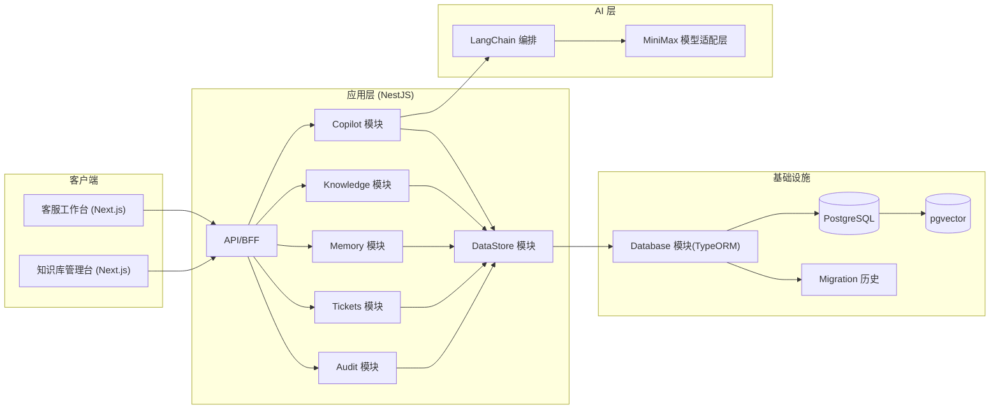

# 客服 Copilot 架构设计（MVP）

## 1）产品目标
构建一个企业内部客服 Copilot，帮助客服人员：
1. 从知识库快速检索答案并生成可编辑草稿。
2. 在低置信度场景自动给出澄清问题或升级工单建议。
3. 将关键动作写入审计日志，支持追踪与复盘。

## 2）设计原则
1. **人审后发送**：默认 Human-in-the-loop，不直接自动回复客户。
2. **模块化优先**：前端、后端都按业务模块拆分，便于扩展。
3. **数据库变更可追踪**：所有建表/改表必须通过 migration。
4. **配置外置**：API Key、数据库连接、阈值全部走环境变量。

## 3）模块化规范来源
1. 前端模块化规范参考：`nextjs-template/src`（按 `app/components/services/hooks/lib` 分层）。
2. 后端模块化规范参考：`42service`（按业务模块拆分 + TypeORM migration 管理数据库历史）。

## 4）整体架构

## 5）后端模块职责
1. `knowledge`：知识文章管理与检索。
2. `memory`：客户长期事实与会话短期摘要。
3. `copilot`：检索编排、置信度判断、动作决策。
4. `tickets`：升级工单创建与查询。
5. `audit`：审计事件记录与查询。
6. `data-store`：统一数据仓储层（当前基于 TypeORM Repository）。
7. `database`：数据库连接、实体注册、migration 管理。

## 6）关键流程
1. 客服提交问题。
2. 读取客户长期记忆 + 会话短期记忆。
3. 检索知识库并生成引用。
4. 计算置信度并决策 `reply / clarify / escalate`。
5. 更新会话摘要。
6. 写入审计日志。
7. 如需升级则创建工单。

## 7）数据库策略
1. 主库：PostgreSQL。
2. 向量扩展：pgvector（已在 migration 中创建扩展字段）。
3. 变更方式：只允许 migration 变更 schema，不手改线上表。
4. 历史可见：`src/database/migrations` 保留完整历史。

## 8）环境与安全策略
1. 所有配置通过 `.env` 注入，不在代码硬编码。
2. 环境变量启动时进行校验，提前失败。
3. 生产/测试环境通过 `NODE_ENV` + migration 命令切换。
