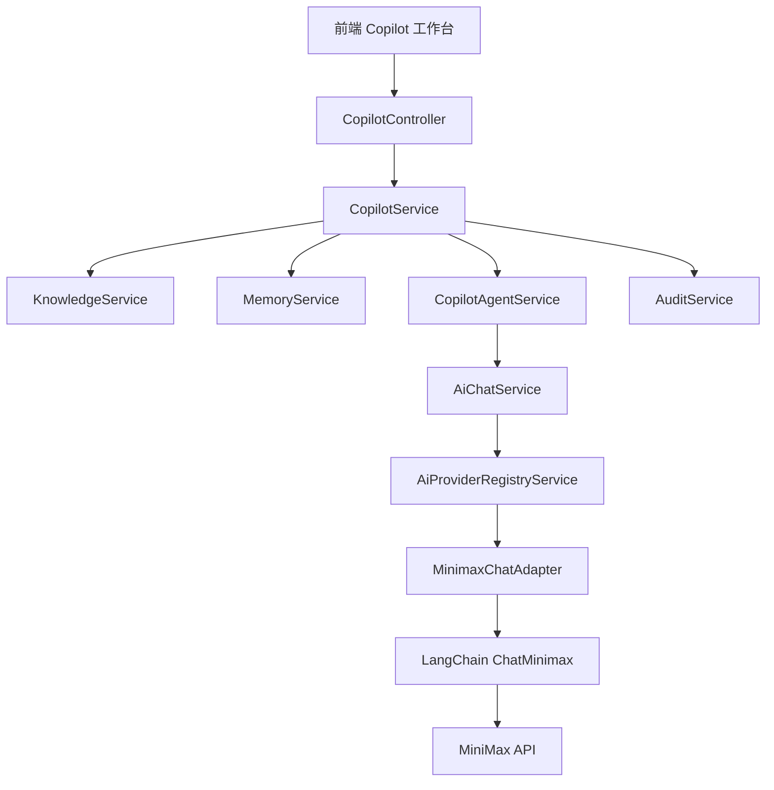

# LangChain 模型适配层与 MiniMax 接入

## 1. 这份改造到底解决了什么问题

在这次改造之前，`CopilotService` 只能做两件事：
1. 检索知识库
2. 按固定规则拼接回复

这样虽然稳定，但有两个明显问题：
1. 回复内容比较“硬”，不够像真实客服话术。
2. 一旦以后接入第二家模型，如果直接把 SDK 写进业务层，后面会越来越乱。

所以这次不是“只接个 MiniMax”，而是先把结构搭对：
1. 业务层只关心“我要一个结构化决策结果”
2. AI 层负责“到底用哪家模型、怎么传参数、怎么处理返回值”

## 2. 当前架构图



## 3. 各层职责

### 3.1 `CopilotService`

职责：业务编排。

它负责：
1. 校验入参
2. 读取长期记忆、短期记忆
3. 召回知识库 citation
4. 调用 AI 决策服务
5. 对 AI 输出做守卫
6. 写审计、写会话记忆、写长期事实

它不负责：
1. 选择具体模型厂商
2. 管理 MiniMax 参数
3. 处理模型 SDK 差异

### 3.2 `CopilotAgentService`

职责：把业务上下文组织成一段适合模型理解的结构化输入。

它负责：
1. 通过 LangChain `ChatPromptTemplate` 组装 prompt
2. 要求模型输出 JSON
3. 用 `zod` 校验 JSON 结构

你可以把它理解成：
1. 上接业务语义
2. 下接通用 AI 接口

### 3.3 `AiChatService`

职责：统一聊天能力入口。

它负责：
1. 判断 AI 是否开启
2. 向下调用 provider registry

它的价值在于：
1. 让业务层不用直接知道 provider 是谁

### 3.4 `AiProviderRegistryService`

职责：按配置找到正确的 provider adapter。

当前只有一个：
1. `minimax`

未来可以继续加：
1. `qwen`
2. `doubao`
3. `openai`
4. 企业自建模型网关

### 3.5 `MinimaxChatAdapter`

职责：把统一的聊天请求，翻译成 MiniMax 能理解的调用方式。

它负责：
1. 创建 `ChatMinimax`
2. 注入 `model / apiKey / groupId / timeout / temperature / maxTokens`
3. 把统一 `messages` 转成 LangChain Message
4. 处理 MiniMax 返回结果，统一成标准响应

这就是“适配器模式”的核心价值：
1. 上层只认统一协议
2. 下层自己适配厂商差异

## 4. 为什么这叫“可扩展”，不是“先写死以后再说”

如果你现在直接在 `CopilotService` 里这样写：

```ts
const model = new ChatMinimax({...})
const res = await model.invoke(...)
```

短期看最快，长期问题很多：
1. `CopilotService` 会知道 MiniMax 的所有参数细节
2. 以后接入千问/豆包时，要直接改业务服务
3. 同一个项目里不同模块可能各自 new 不同 SDK，最终无法统一治理

现在这个结构的好处是：
1. 业务层只认 `ChatGenerationRequest`
2. provider 差异留在 adapter 内部
3. 后面新增 provider 时，只需要：
   - 新增一个 adapter
   - 在 registry 注册
   - 配置 provider 名称

## 5. 当前统一聊天接口长什么样

核心抽象在：`src/modules/ai/types/chat.types.ts`

统一请求里目前最关键的字段有：
1. `messages`
2. `temperature`
3. `maxTokens`
4. `timeoutMs`
5. `responseSchema`

这里的重点是 `responseSchema`。

因为不同模型“结构化输出”的做法不一样：
1. 有的支持 JSON mode
2. 有的支持 function calling
3. 有的只能靠 prompt 约束

所以我们不把厂商私有参数暴露给业务层，而是先抽象成“我希望你返回这个结构”。

当前 MiniMax adapter 会把它映射为对应的 JSON 约束方式。

## 6. 为什么 Copilot 还要守卫逻辑

接了大模型以后，很多人容易犯一个错：
1. 让模型直接返回给用户

客服场景不适合这么做。因为模型再强，也可能：
1. 在 citation 为空时还给肯定答复
2. 忘记补澄清问题
3. 升级处理时没给工单信息
4. 抽取出不该长期保存的客户信息

所以我们在 `CopilotService` 里又加了一层守卫：
1. citation 为空时，不允许高置信度直接 reply
2. `clarify` 没填问题时补默认值
3. `escalate` 没给 ticketSuggestion 时补默认值
4. 客户事实去重后再写入长期记忆

这层逻辑非常重要，因为它体现的是：
1. AI 是能力增强层
2. 业务规则才是最终边界

## 7. 当前启用方式

### 7.1 规则版（默认）

```env
AI_CHAT_ENABLED=false
```

特点：
1. 不依赖外部模型
2. 更稳定
3. 适合先跑通项目

### 7.2 MiniMax 版

```env
AI_CHAT_ENABLED=true
AI_CHAT_PROVIDER=minimax
AI_CHAT_MODEL=abab5.5-chat
MINIMAX_API_KEY=你的密钥
MINIMAX_GROUP_ID=你的 GroupId
```

特点：
1. 走 LangChain + MiniMax 结构化决策
2. 输出会更自然
3. 同时保留业务守卫和 fallback

## 8. 以后怎么接入第二家模型

假设以后要接千问，大致步骤是：

1. 新增 `qwen-chat.adapter.ts`
2. 实现 `ChatCapabilityAdapter`
3. 在 `AiProviderRegistryService` 注册 `qwen`
4. 在 `configuration.ts` 和 `env.validation.ts` 增加对应配置
5. 把 `AI_CHAT_PROVIDER` 改成 `qwen`

注意：
1. `CopilotService` 不需要改
2. `CopilotAgentService` 不需要改
3. 前端完全不需要改

这就是这次拆层真正省出来的维护成本。

## 9. 当前还没做什么

这次虽然已经接了 LangChain，但还没有把它做到“完整 Agent 平台”那一步。

当前还没做：
1. 向量数据库召回
2. Embedding 入库任务
3. 工具调用链（例如查订单、查物流）
4. 多 provider 并行比对或降级策略
5. 图片 / 视频 capability 的真实 adapter

所以你现在可以把它理解成：
1. 已经完成了 AI 基础设施层
2. 但更高级的 RAG / Tool Calling / Multi-agent 还在下一阶段

## 10. 面试时可以怎么讲

你可以这样概括：

1. 我先把客服 Copilot 做成可运行的数据库化 MVP。
2. 然后我没有直接把某个模型 SDK 写死在业务层，而是先抽了统一 AI 适配层。
3. 现在接的是 LangChain 官方 `ChatMinimax`，但业务层只依赖统一聊天接口。
4. Copilot 输出不是自由文本，而是结构化 JSON 决策，并且后面还有业务守卫兜底。
5. 这个结构为后续接千问、豆包、向量检索、工具调用都留好了扩展位。
